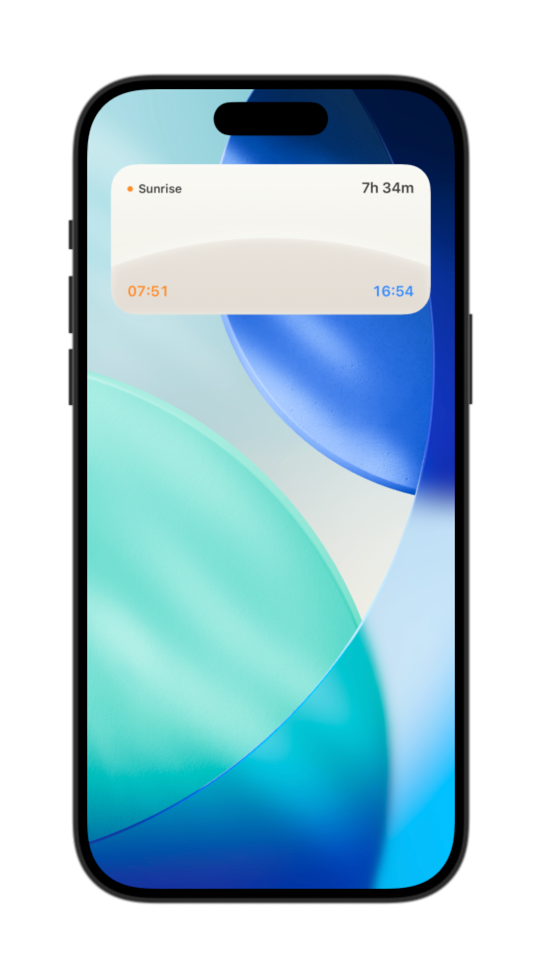
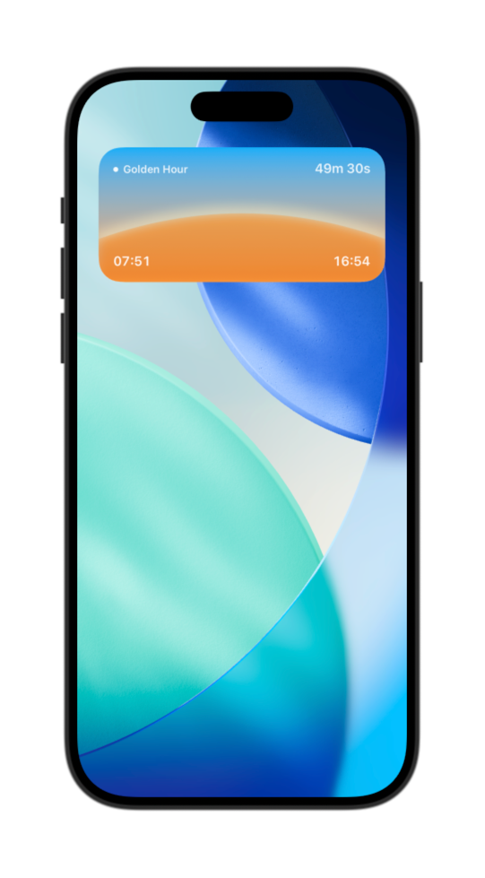
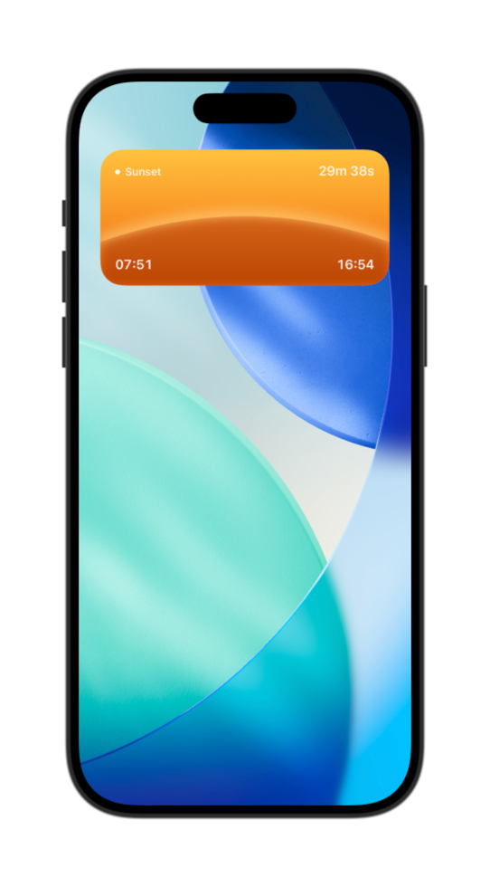
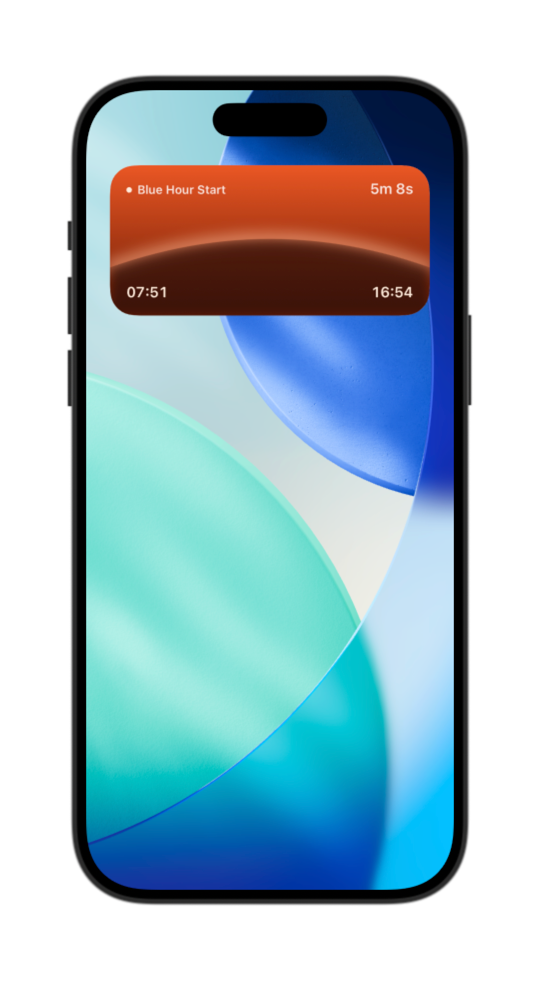
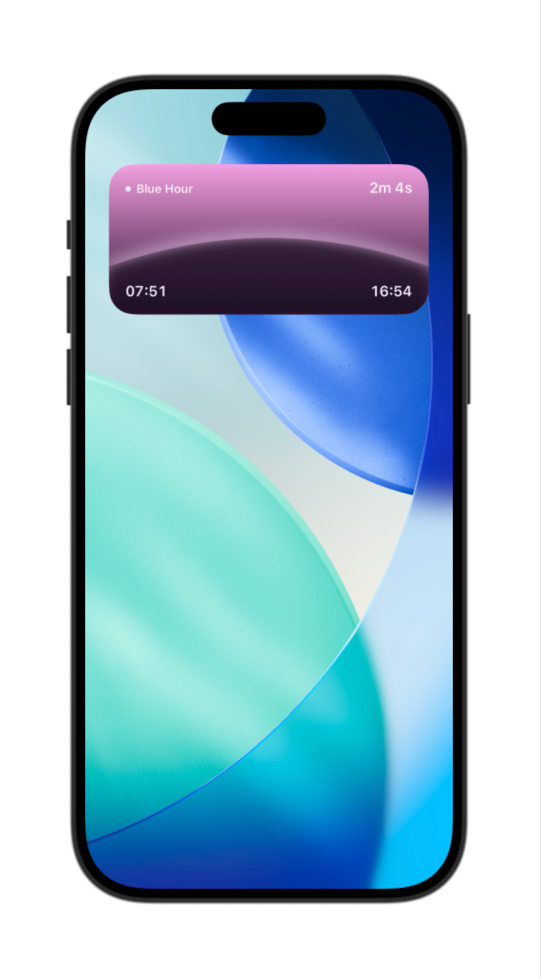
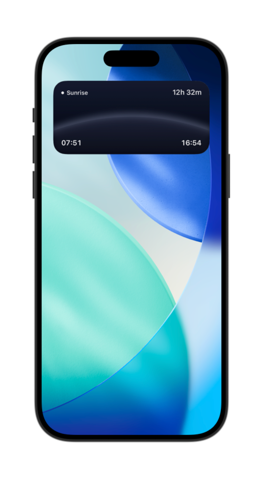

# Horizon — Sun Phases Widget (iOS / WidgetKit)

A lightweight iOS home-screen widget that visualizes key sun/photography phases (sunrise/sunset + golden hour + blue hour) with a minimal “horizon” design.

> Built with SwiftUI + WidgetKit using an `AppIntentTimelineProvider`.

## Why this project exists

I’m a photography hobbyist, and the most magical light is the hour before/after sunrise and sunset. Those are the moments when the sun angle is perfect and the scene comes alive. This widget keeps that sweet spot front and center—no math, no guessing—so I know exactly when to head out and shoot.

## What it shows

- **Phase label** (e.g. Sunrise / Golden Hour / Sunset / Blue Hour…)
- **Countdown to next boundary** (e.g. “49m 30s”)
- **Sunrise / Sunset time** (HH:mm)
- A phase-themed gradient background + horizon band/highlight
- Phase gallery (see screenshots below)

<table>
  <tr>
    <td align="center">
      <br/>
      <sub>Sunrise — Neutral to harsh daylight</sub>
    </td>
    <td align="center">
      <br/>
      <sub>Golden Hour — Warm, directional light</sub>
    </td>
    <td align="center">
      <br/>
      <sub>Sunset — Rapidly changing warm tones</sub>
    </td>
  </tr>
  <tr>
    <td align="center">
      <br/>
      <sub>Blue Hour Start — Cool tones with residual warmth</sub>
    </td>
    <td align="center">
      <br/>
      <sub>Blue Hour — Deep blue, low light</sub>
    </td>
    <td align="center">
      <br/>
      <sub>Night — Very low light</sub>
    </td>
  </tr>
</table>

> The current implementation splits **Blue hour** into *start* and *remaining* to better match real photography decision points.


## Project status

✅ UI prototype completed  
✅ Real astronomical time–driven timeline implemented  
✅ Phase transitions validated against system Weather app  
✅ Medium-size widget (systemMedium) only (small removed)

## Project structure

Key files:

- `HorizonWidget.swift`  
  Widget configuration, timeline provider, entries, and previews.

- `HorizonArcShape.swift` / `HorizonFillShape.swift`  
  Horizon geometry for the arc highlight and filled ground band.

- `SunAstronomy.swift`  
  Solar time calculations (sunrise/sunset + photography-related times) and phase resolution.

- `SunWidgetModel.swift`  
  View model containing phase, sunrise/sunset strings, and countdown text.

- `SunWidgetView.swift`  
  SwiftUI layout and drawing (gradient background, horizon arc, typography).

- `SunTheme.swift` / `SunPhase.swift`  
  Phase definitions and per-phase visual themes (gradients/colors). 

## Phase logic (current)

The widget timeline is driven by real astronomical times and switches phases at these boundaries:

- Today **sunrise**
- **Golden hour start**
- **Sunset**
- **Blue hour start** → **Blue hour remaining** (midpoint split)
- **Blue hour end**
- Next day **sunrise**

The countdown always points to the *next upcoming boundary*.

## Getting started

1. Open `Horizon.xcodeproj` in Xcode  
2. Select the **HorizonWidgetExtension** scheme  
3. Run on an iOS Simulator  
4. Add the widget to the Home Screen (systemMedium)

### Preview

The project includes `#Preview(as: .systemMedium)` samples covering all phases via preview entries in `HorizonWidget.swift`.

## Configuration

Location is currently hard-coded in `Provider`:

```swift
private let latitude: Double = 43.6532
private let longitude: Double = -79.3832
```

Timezone uses `Calendar.current.timeZone`.

## Design goals

- Clean, card-less widget surface (full-bleed background)
- Phase-based color language inspired by Apple Weather
- Minimal but expressive horizon visualization
- Accurate time math with strict UTC → local conversion discipline
- Split blue hour into start/remaining to match photography use cases

## Next steps

- Use real device location (privacy-aware)
- AppIntent-based location selection
- Support multiple widget sizes
- Optional Live Activity / Lock Screen variant
- Fine-tune gradients & highlight intensity

## Notes

Widgets have limited execution time. Timeline entries are generated only at meaningful astronomical boundaries to preserve system performance.

## License

This project is released under the MIT License.
Design and visual concepts are inspired by Apple Weather.
